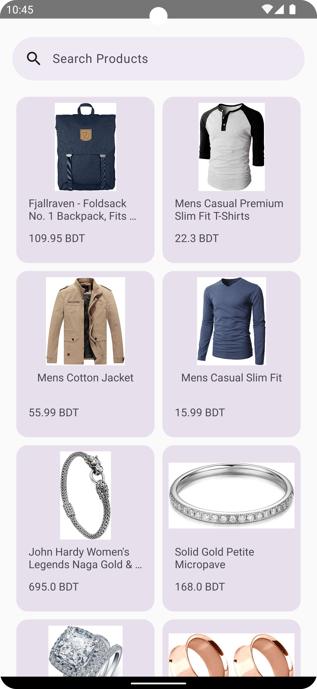
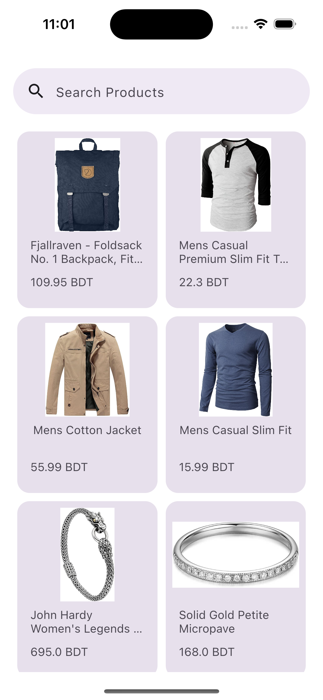
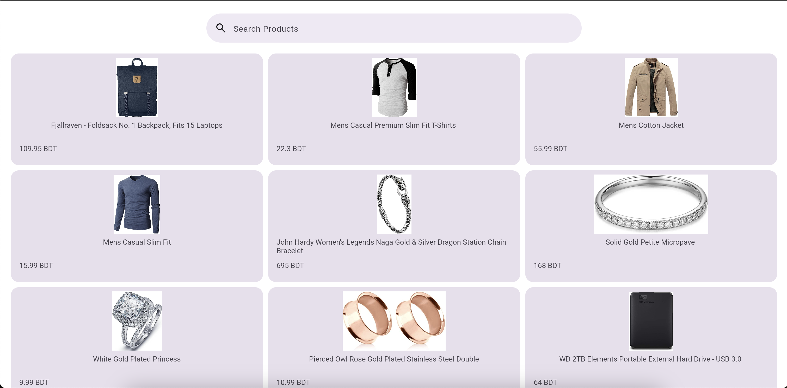
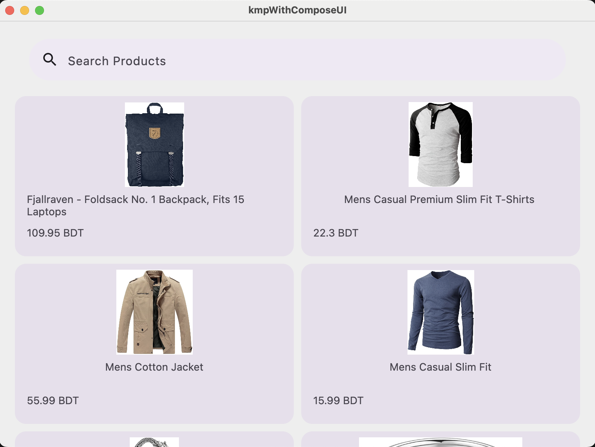

#### KMP With Compose UI (Share UI -with Compose Multiplatform UI framework)
##### Uses Dependencies
// Kotlinx Serialization
```agsl
https://github.com/Kotlin/kotlinx.serialization
```

// Kotlinx Coroutines
```agsl
https://github.com/Kotlin/kotlinx.coroutines
```

// ktor client for Android and iOS  
```agsl
https://www.jetbrains.com/help/kotlin-multiplatform-dev/multiplatform-ktor-sqldelight.html#add-gradle-dependencies
```

// moko mvvm
```agsl
https://github.com/icerockdev/moko-mvvm
```

// compose image loader
```agsl
https://github.com/qdsfdhvh/compose-imageloader
```

// We will use fake store api for this project

```agsl
https://fakestoreapi.com/
```

```agsl
https://fakestoreapi.com/products/
```

// For Web app (JS)
  - Step 1　→　Add Tool bundler for converting Kotlin/Native code to JavaScript code.
  - Step 2　→　Add this for JsCanvas[in: gradle.properties] (org.jetbrains.compose.experimental.jscanvas.enabled=true)
  - Step 3　→　Add Compose Experimental Accessors `compose.experimental { web.application {} }`
  - Step 4　→　Add Resources for web (index.html) and others.
// Finally you can run webApp (you can edit configurations)
```agsl
composeApp:jsBrowserDevelopmentRun
```

🧬 Samples
------------

| Android                                                                               | IOS                                                                               |
|---------------------------------------------------------------------------------------|-----------------------------------------------------------------------------------|
|  |  |


| Web app                     |
|-----------------------------|
|  |

| Desktop app                         |
|-------------------------------------|
|  | 


This is a Kotlin Multiplatform project targeting Android, iOS, Desktop and Web.

* `/composeApp` is for code that will be shared across your Compose Multiplatform applications.
  It contains several subfolders:
  - `commonMain` is for code that’s common for all targets.
  - `androidMain` is for code that,s for android target.
  - `desktopMain` is for code that,s for desktop target.
  - `jsMain` is for code that,s for Web target.
  - Other folders are for Kotlin code that will be compiled for only the platform indicated in the folder name.
    For example, if you want to use Apple’s CoreCrypto for the iOS part of your Kotlin app,
    `iosMain` would be the right folder for such calls.

* `/iosApp` contains iOS applications. Even if you’re sharing your UI with Compose Multiplatform,
  you need this entry point for your iOS app. This is also where you should add SwiftUI code for your project.

Learn more about [Kotlin Multiplatform](https://www.jetbrains.com/help/kotlin-multiplatform-dev/get-started.html)…